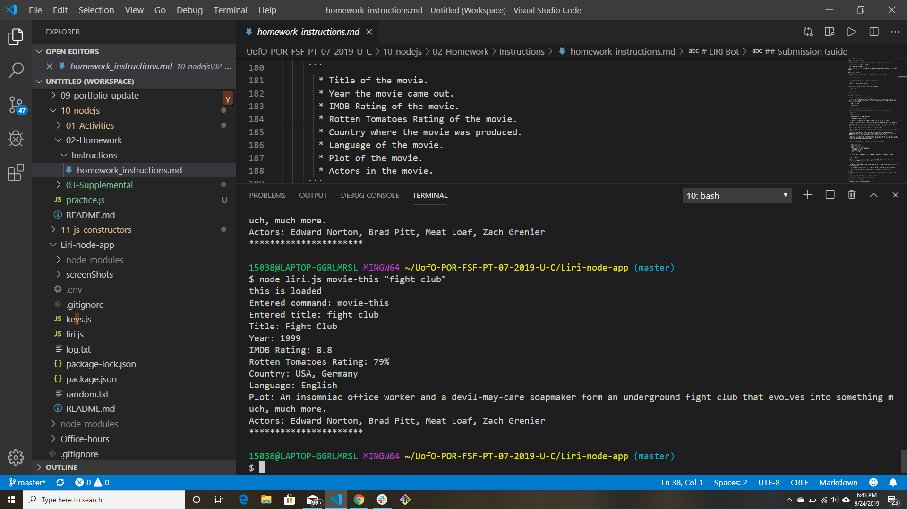

# Liri-node-app
LIRI is like iPhone's SIRI. However, while SIRI is a Speech Interpretation and Recognition Interface, LIRI is a _Language_ Interpretation and Recognition Interface. LIRI will be a command line node app that takes in parameters and gives you back data.
Commands you may input are as follows:
1: concert-this
2: spotify-this-song
3: movie-this
4: do-what-it-says
Each command can be followed by what you are searching for, with the acception being the number 4 command that defaults to a given artist.

.png)
.png)
.png)
